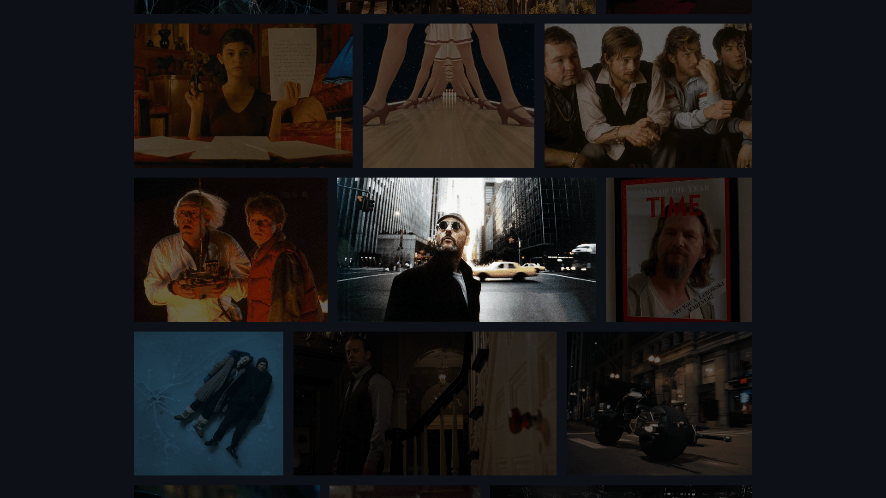

<div align="center">
  <a href="https://gallery-movies.netlify.app/" target="_blank">
    
  </a>
  </br></br>
  <h3 align="center">🎬 Galerie d'Images &nbsp;–&nbsp; Films Cultes</h3>
</div>

## <br /> 📌 Sommaire

&nbsp;&nbsp;&nbsp; 🎨 &nbsp; [**Introduction**](#introduction)<br />
&nbsp;&nbsp;&nbsp; 🛠️ &nbsp; [**Technologies**](#technologies)<br />
&nbsp;&nbsp;&nbsp; 🎯 &nbsp; [**Fonctionnalités**](#fonctionnalités)<br />
&nbsp;&nbsp;&nbsp; 🚀 &nbsp; [**Installation**](#installation)<br />

## <br /> <a name="introduction">🎨 Introduction</a>

Galerie visuelle rendant hommage au cinéma culte des années 90 et 2000, à travers une mosaïque responsive élégamment construite en HTML et CSS pur.

Chaque image adopte un format spécifique (1:1, 5:4, 16:9) pour créer un rythme visuel cinématographique et captivant.

Parfait pour une landing page artistique, une archive d’inspiration ou un hommage immersif à l’univers du 7ᵉ art.

## <br /> <a name="technologies">🛠️ Technologies</a>

- HTML5 sémantique et accessible
- CSS3 moderne avec Flexbox et media queries
- Filtres CSS pour effets de survol
- Structure responsive fluide sans frameworks
- Images .webp optimisées pour la performance

## <br /> <a name="fonctionnalités">🎯 Fonctionnalités</a>

- Grille d’images flexible et auto-adaptative
- Filtres de luminosité dynamiques au survol
- Ratio d’images mixés pour un effet cinématographique
- Responsive mobile et desktop optimisé
- Mosaïque continue avec flex-grow
- Expérience visuelle cohérente et immersive
- Code minimaliste sans dépendance externe

## <br /> <a name="installation">🚀 Installation</a>

### ✅ Prérequis

- [Google Chrome](https://www.google.com/) &nbsp;—&nbsp; Navigateur moderne
- [Visual Studio Code](https://code.visualstudio.com/) &nbsp;—&nbsp; Éditeur de code
- [Live Server](https://marketplace.visualstudio.com/items?itemName=ritwickdey.LiveServer) &nbsp;—&nbsp; Extension VS Code

### 📥 Cloner le projet

```bash
git clone https://github.com/ValentinMadiot/gallery-movies_css
cd gallery-movies_css
```

### ▶️ Lancer le projet

Ouvre simplement le fichier `index.html` dans ton navigateur, ou utilise l’extension **Live Server** pour une prévisualisation dynamique.
